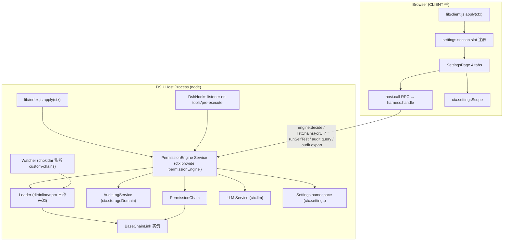
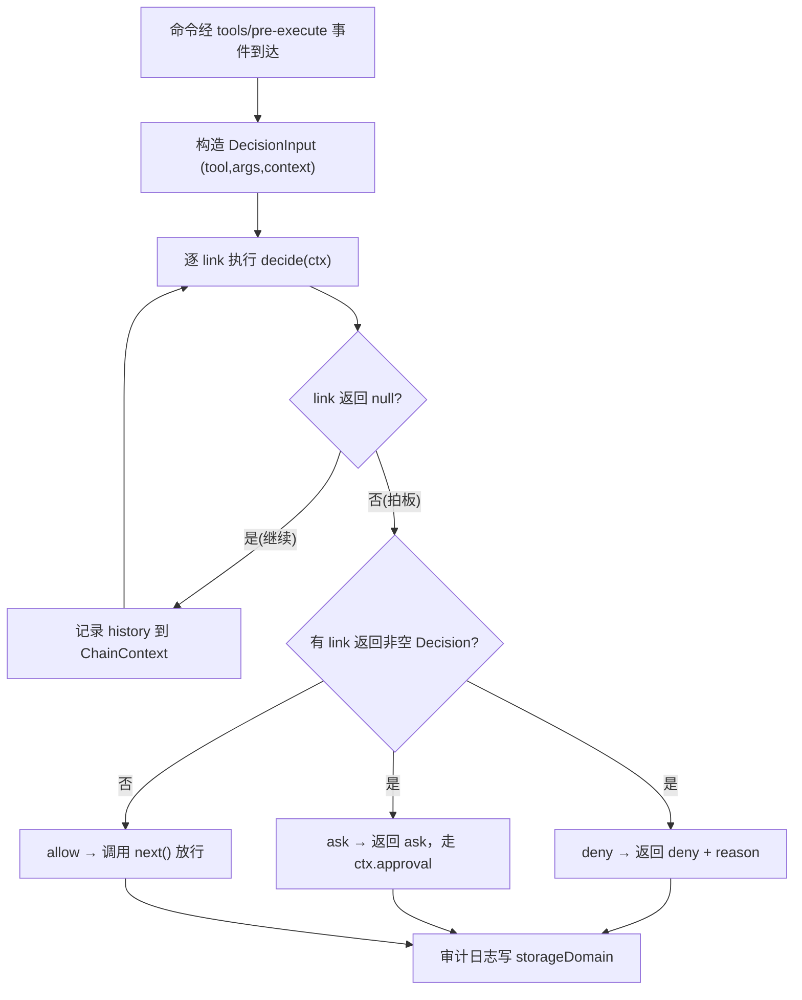
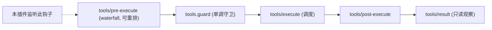

# dsh-permission-engine 技术设计文档

Feature Name: dsh-permission-engine
Updated: 2026-08-18

## Description

`dsh-permission-engine` 是 DeepSeek Harness (DSH) 的客户端插件，用于消除 "DSH 每个 bash 调用都要点 Approve 太烦" 的痛点。插件在 DSH 的 `tools/pre-execute` 钩子处插入一条可配置的**责任链**：链上每个 link 对命令做独立决策，第一个返回非空决策的 link 胜出。

插件拆分为两个可独立发版的 npm 包：

| 包 | 职责 | 依赖方向 |
|---|---|---|
| `@yourname/dsh-permission-engine` | 框架：链类型、BaseChainLink、PermissionEngine Service、DSH 集成、审计、UI | 无（peer: DSH 各标准包） |
| `@yourname/dsh-permission-engine-defaults` | 6 条默认 link（L0 硬拒绝 / L1 只读 / L2 白名单 / L3 评分+LLM / L4 记忆） | peer: 框架包 |

本设计基于 DSH 官方包源码（`@deepseek-ai/dsh-*`，v0.0.1-rc.x）核实的真实 API 撰写。**需求原文中 `event.deny(reason)` / `event.ask(reason)` 的钩子 API 与 DSH 实际 API 不符**，实际契约是返回 `PreToolDecision` 的 waterfall（见 D1 决策记录）。

## Architecture

### 总体架构（双半插件）



### 责任链执行流程



### DSH 工具管线集成位置



本插件只监听 `tools/pre-execute` 一个钩子，不触碰 `tools.guard`/`tools/execute` 等后续阶段，确保与 DSH 内置 sandbox/approval 机制**叠加**而非替代（REQ-3）。

## Components and Interfaces

### 包结构与入口

```
dsh-permission-engine/                        # 框架包
├── package.json                               # 双半 exports + dsh.client 字段
├── lib/index.js                               # HOST 半 apply(ctx)
├── lib/client.js                              # CLIENT 半 apply(ctx)
├── lib/chain/link.js                          # BaseChainLink 抽象类
├── lib/chain/chain.js                         # PermissionChain 组合器
├── lib/chain/engine.js                        # PermissionEngine Service
├── lib/chain/registry.js                      # defineLink helper
├── lib/chain/loader.js                        # 3 种来源加载
├── lib/chain/watcher.js                       # chokidar 监听
├── lib/chain/templates/link-demo.js           # demo 模板源码
├── lib/integration/dsh-hooks.js               # tools/pre-execute 监听
├── lib/integration/audit-log.js               # storageDomain 持久化
├── lib/services/PermissionEngine.js           # 引擎实现（注册/决策/测试/UI 数据）
├── lib/dev/{allow,deny,echo}-link.js          # 开发测试 link
├── lib/ui/*.js                                # CLIENT 端 UI 组件（React）
├── lib/types/{index,chain}.d.ts
├── lib/types/client/index.d.ts
└── tests/**/*.test.js                         # vitest

dsh-permission-engine-defaults/                # defaults 包
├── package.json                               # peer dep 框架包
├── lib/index.js                               # registerLinks(ctx, engine) 导出
├── lib/risk.js                                # 默认评分函数（JS 字符串）
├── lib/patterns/{default-hard-deny,default-safe-read,default-llm-prompt}.js
├── lib/links/L{0,1,2,3a,3b,4}-*.js            # 6 条 link，每条带 static tests
└── tests/links/*.test.js
```

### package.json 关键字段（框架包）

```json
{
  "name": "@yourname/dsh-permission-engine",
  "type": "module",
  "main": "lib/index.js",
  "exports": {
    ".": { "types": "./lib/types/index.d.ts", "default": "./lib/index.js" },
    "./client": { "types": "./lib/types/client/index.d.ts", "default": "./lib/client.js" },
    "./chain/link": "./lib/chain/link.js",
    "./package.json": "./package.json"
  },
  "dsh": {
    "client": {
      "inject": ["slots", "locale"],
      "platform": "web"
    }
  },
  "peerDependencies": {
    "@deepseek-ai/cordis": "^4.0.1-rc.1",
    "@deepseek-ai/dsh-settings": "^0.0.1-rc.1",
    "@deepseek-ai/dsh-storage-domain": "^0.0.1-rc.1",
    "@deepseek-ai/dsh-tools": "^0.0.1-rc.1",
    "@deepseek-ai/dsh-client-runtime": "^0.0.1-rc.1",
    "@deepseek-ai/dsh-client-ui-slots": "^0.0.1-rc.1"
  }
}
```

**CLIENT 半加载约束**（已从 `@deepseek-ai/dsh-cordis-client-runner` 源码核实）：浏览器半源码作为 async function body 运行，符号表面只有 `{ React, console, styles, host }`，无 JSX、无 module import。因此 `lib/ui/*.js` 编写时使用 `React.createElement`（或借助构建时 JSX 转译产出纯 JS），不写 `import`。

### HOST 半组件

#### PermissionEngine Service（`lib/services/PermissionEngine.js`）

注册为 cordis service：`ctx.provide('permissionEngine', engine)`。暴露接口：

```ts
class PermissionEngine {
  constructor(ctx, config)
  // 链管理
  registerLink(link: ChainLink, opts?: { order?: number; enabled?: boolean; registeredBy?: string }): void
  unregisterLink(linkId: string): void
  setEnabled(linkId: string, enabled: boolean): void
  reorder(orderedIds: string[]): void
  // 决策
  decide(input: DecisionInput, opts?: { test?: boolean }): Promise<EngineDecision>
  // 测试（R7）
  runSelfTest(linkId: string): Promise<SelfTestResult[]>
  // UI 数据（R5）
  listChainsForUI(): Promise<GroupedLinks>
  // 配置生效（R2）
  reloadFromSettings(): void
}
```

关键行为：
- `decide` 执行整条链，维护 `ChainContext`（`input` + `tags` + `history`），第一个非空决策胜出，全空则 allow。
- `decide` 同时触发 3 项横切：审计记录（REQ-1.4）、沙箱感知、上下文感知，通过 ChainContext.tags 透传给各 link。
- 决策结果**不缓存**（REQ-2.5），每次调用实时读 settings + 实时跑链。

#### BaseChainLink（`lib/chain/link.js`）

需求给定的类型契约（`lib/types/chain.d.ts`）为准。补充细节：
- `static tests` 由子类声明，基类默认 `[]`；构造时通过 `config.tests` 或读取 `this.constructor.tests` 归一化（兼容 `static` 与实例两写法）。
- `runSelfTest()` 对每个 TestCase 构造独立 ChainContext（`tags:{}`、`history:[]`），执行 `decide`，把 `expected` 与 `'pass'`（返回 null）或 `kind`（返回决策）比对，产出 `{ name, passed, actual, expected, error? }`。
- 辅助方法 `allow/deny/ask/pass`。

#### PermissionChain（`lib/chain/chain.js`）

纯组合器：持有排序后的 `ChainLinkRegistration[]`（按 `order` 升序），`run(input)` 依序调用 `link.decide(ctx)`，记录每步 `{ linkId, linkName, outcome, decision?, durationMs, skipped?, error? }` 到 `ctx.history`；link 抛错时记 `error` 并**继续**到下一 link（错误隔离，REQ-4.2）。返回 `{ decision: Decision | null, history }`。

#### Loader（`lib/chain/loader.js`）——3 种来源

| 方法 | 来源 | 实现 |
|---|---|---|
| `loadFromDirectory(dir)` | 本地 `*.js` | `fs/promises.readdir` + `import(pathToFileURL(...))`，取 default 导出，实例化；每文件返回 `{ link, source, error? }` |
| `loadFromInlineCode(code)` | 设置页内联 | `new Function` 沙箱化执行（见 D3），要求代码构造并返回 link 实例 |
| `loadFromPackage(packageName)` | npm | `import(packageName)` 动态加载，调其 `registerLinks`/default 导出 |

`loadFromInlineCode` 的沙箱签名：
```js
const sandbox = new Function('require', 'import', 'process', 'module', 'exports', 'console',
  '"use strict";\n' + code + '\n;return module.exports ?? null')
sandbox(undefined, undefined, undefined, sandboxModule, sandboxModule.exports, safeConsole)
```
- 通过**变量遮蔽 + 不提供真实实现**拒绝 `require/import/process` 访问（REQ-13.2）；`module.exports` 是内部构造的收集对象。
- 直接 `eval` 仍可访问局部作用域 —— 这是 `new Function` 方案的已知边界，威胁模型为单用户本地工具（见 D3 与 §Error Handling）。

#### DshHooks（`lib/integration/dsh-hooks.js`）

```js
ctx.on('tools/pre-execute', async (exec, next) => {
  const input = toDecisionInput(exec, ctx)
  const result = await engine.decide(input)
  if (result.decision.kind === 'deny')  return { kind: 'deny', reason: result.decision.reason }
  if (result.decision.kind === 'ask')   return { kind: 'ask', reason: result.decision.reason }
  return next()                       // allow → 交给下一个监听器
})
```

关键点（D1）：
- **必须调用 `next()` 才表示放行**；waterfall 语义下，返回非 undefined 值即短路该次调用。因此 handler 只在 allow 时 `return next()`。
- `toDecisionInput` 把 `ToolExecution` 映射为 `DecisionInput`：`tool = exec.name`（如 `'bash'`）、`args = exec.arguments`（`{ command, workdir, ... }`，已由 DSH 做 lossless-JSON 冻结）。
- 上下文感知：sessionId/workspaceId 取自 `exec.agent` 或 `ctx.session`（实现时确认可用渠道）；`sandboxed` 经 `ctx.get('sandbox')` 读取当前 sandbox mode；`isGitRepo`/`recentUserMessages` 为可选增强，取不到时给安全默认值（`isGitRepo:false`、`recentUserMessages:[]`）。
- 监听器注册通过 `ctx.on`，卸载时由 cordis fiber 自动清理（可逆副作用，符合 DSH 插件规范）。

#### AuditLogService（`lib/integration/audit-log.js`）

- 用 `ctx.storageDomain` 声明并打开 domain（REQ-10.2）：
```ts
const auditDomain = defineDomain({
  name: 'permission-audit',
  schema: { tables: { records: { key: z.string(), value: AuditRecord } } },
})
const domain = await ctx.storageDomain.open(auditDomain)
// domain.close() 挂到 ctx.effect disposer
```
- `append(record)` 走 `domain.tables.records.put(record.id, record)`（DSH 写链串行、durability-first）。
- `query(filter)`：同步读 + 按时间/会话/决策/工具过滤。
- `export(filter, format)`：生成 JSON / CSV 文本，经 harness.handle 回传 CLIENT 下载。
- 存储介质由 DSH 的 storage backend 决定（实际落盘即需求中的 `permission-audit.jsonl`），插件不感知具体路径。

### CLIENT 半组件（`lib/ui/`）

#### 入口注册（`lib/client.js`）

```js
ctx.locale.register('permission-engine', { zh: {...}, en: {...} })   // REQ-12

ctx.slots.inject('settings.section', () => ctx.slots.register(
  { name: 'settings.section', id: 'permission-engine', order: 100, label: () => t('settings.title') },
  SettingsPage,
))
```
`settings.section` 是 DSH 设置页的页面级 slot（`{ id, order, label }`），与 `settings.general`（单行偏好）区分；本插件需要整页（Chains/Tester/Audit/About 四 tab），故用 `settings.section`。

**为何不用官方 `settings.plugin.item` 卡片槽**：`adding-a-settings-card.md` 描述的"插件配置卡片"注册在 `settings.plugin.item` 槽，由 Plugin configuration tab 按 **Host 实际 serve 的 namespace** 渲染 —— 而 `dsh-host-apiproxy` 只 serve 硬编码白名单 namespace，第三方插件的 `permission-engine` namespace 不会出现在该 tab（即使注册了卡片也渲染为空）。且该卡片写法依赖 `ctx.settingsScope` 直读直写，同样被 `settings-not-exposed` 拦截。故第三方插件配置 UI 只能走 `settings.section` 整页 + RPC（D9）。

#### 组件清单与职责

| 组件 | 职责 | 数据来源 |
|---|---|---|
| `SettingsPage` | 4 tab 容器（Chains/Tester/Audit/About），持有 tab 状态 | `host.call`（配置/链/审计全走 RPC） |
| `ChainConfig` | 按来源分组展示全部 link；启用/禁用/重排；每条 link 一个"跑测试"按钮；"+ 添加链"；"重置为默认" | `host.call('engine.listChainsForUI')` |
| `LinkTestResults` | 渲染 `runSelfTest` 结果（✅/❌ 列表） | `host.call('engine.runSelfTest', { linkId })` |
| `CommandTester` | 命令输入框 + Run 按钮 + 结果面板 | `host.call('engine.decide', { tool:'bash', args:{command}, ... })` |
| `ChainFlow` | 横向 stepper：每条 link 一个节点，命中节点高亮，尾部显示最终决定 | decide 返回的 `history` |
| `AuditLogTab` | 筛选（时间/会话/决策/工具）+ 列表 + 详情 + 导出 | `host.call('audit.query'/'audit.export')` |
| `AddChainDialog` | 3 tab：内联代码（CodeEditor+demo 模板+跑测试+保存）/ 本地文件列表 / npm 包 | `host.call('chains.*')` |
| `CodeEditor` | 基于 CodeMirror 的轻量编辑器（避免重依赖，见 D4） | — |
| `About` | 版本/文档/issue 链接 | 静态 |

#### 跨半 RPC 契约（`harness.handle` ↔ `host.call`）

HOST 半统一在 `lib/index.js` 注册以下方法（双向 JSON only，省略参数传 `null`）：

| method | 参数 | 返回 | 用途 |
|---|---|---|---|
| `engine.listChainsForUI` | `null` | `GroupedLinks` | Chains tab 分组数据 |
| `engine.decide` | `{ tool, args, context? }` | `{ decision, history }` | Command Tester 试运行 |
| `engine.runSelfTest` | `{ linkId }` | `SelfTestResult[]` | 跑测试按钮 |
| `engine.setEnabled` | `{ linkId, enabled }` | `void` | 启用/禁用 |
| `engine.reorder` | `{ orderedIds }` | `void` | 重排 |
| `engine.resetToDefaults` | `null` | `void` | 重置 |
| `chains.addInline` | `{ id, name, description, code }` | `{ ok, error? }` | 内联链保存 |
| `chains.listDirectory` | `null` | `{ path, files }` | 本地文件 tab |
| `chains.installPackage` | `{ packageName }` | `{ ok, error? }` | npm 包安装 |
| `config.get` | `null` | `PermissionEngineSettings` | 读取插件配置（白名单规避，见下） |
| `config.update` | `{ patch, expectedRevision }` | `{ revision, value }` | 更新插件配置（含冲突检测） |
| `audit.query` | `{ filter }` | `AuditRecord[]` | 审计列表 |
| `audit.export` | `{ filter, format }` | `string` | 导出 JSON/CSV |

**配置读写必须走 RPC，禁用 CLIENT 直连 settingsScope**：`@deepseek-ai/dsh-host-apiproxy` 对浏览器暴露的 settings namespace 是硬编码白名单 —— 仅 `locale`/`permission`/`ui-conversation`/`ui-theme` + `ui-onboarding`/`agent-preset` + model-provider 的 settingsNs（已从 `lib/index.js` `WEB_SETTINGS_NAMESPACES`/`PRODUCT_SETTINGS_NAMESPACES`/`exposedNamespaces()` 核实）。第三方插件注册的 `permission-engine` namespace 不在白名单，浏览器 `settingsScope` 读写会返回 `settings-not-exposed`。故 CLIENT 一律经 `host.call('config.get'/'config.update')` 走 RPC，由 HOST 半用 `ctx.settings` 的 owner scope 进程内读写（不受 api-proxy 白名单约束），配置变更经 `settings` 事件在 HOST 侧生效并同步推送 CLIENT。

### defaults 包接口

`lib/index.js` 导出：

```js
export function registerLinks(engine, ctx) {
  engine.registerLink(new HardDenyLink({...}), { order: 100, registeredBy: 'defaults' })
  engine.registerLink(new SafeReadLink({...}), { order: 200, registeredBy: 'defaults' })
  engine.registerLink(new AllowlistLink({...}), { order: 300, registeredBy: 'defaults' })
  engine.registerLink(new RiskScoringLink({...}), { order: 400, registeredBy: 'defaults' })
  engine.registerLink(new LlmReviewLink({...}), { order: 500, registeredBy: 'defaults' })
  engine.registerLink(new RememberLink({...}), { order: 600, registeredBy: 'defaults' })
}
```

框架包在 `config.useDefaults !== false` 时**动态** `import('@yourname/dsh-permission-engine-defaults')` 并调用 `registerLinks`（D2）。框架包 `package.json` 不声明对 defaults 的静态依赖（仅 peer/devDeps 提示），保证两包零硬 import（REQ-6）。

### 6 条默认 link 的分层与降级（REQ-1 / REQ-3）

| 层 | link | 决策示例 |
|---|---|---|
| L0 | `HardDenyLink` | 命中硬拒绝正则 → `deny`（`rm -rf /`、`sudo` 等） |
| L1 | `SafeReadLink` | 命中只读命令集（`ls`/`cat`/`git status` 等）→ `allow` |
| L2 | `AllowlistLink` | 用户白名单前缀 → `allow` |
| L3a | `RiskScoringLink` | 内置评分 JS 计算分数；高于阈值 → `ask` |
| L3b | `LlmReviewLink` | 高风险命令交 LLM；失败/超时 → `allow`（降级）并标记 history |
| L4 | `RememberLink` | 记忆 TTL 内同类命令复用上次决定 |

**LLM 降级语义（D6）**：`ctx.llm` 调用失败或超过 `timeoutMs`（默认 30s，AbortController 实现，REQ-13.3）时，`LlmReviewLink` 返回 `allow` 并在 `history`/审计中记录 `degraded:true` —— 即把决策交还给 DSH 自身的 sandbox + approval 兜底，等效需求所述"降级到 safe preset"。DSH 的 `workspace-write` preset（sandbox 限制写入范围 + approval ask）即"safe"语义；插件不写 `sandbox/mode`、不替换 preset（REQ-3.1）。

### Settings 数据模型（`permission-engine` namespace）

```ts
interface PermissionEngineSettings {
  useDefaults: boolean                     // 是否加载 defaults 包
  hardDeny: { patterns: string[] }         // 硬拒绝正则（R2）
  safeRead: { commands: string[] }         // 只读命令集（R2）
  llm: { prompt: string; timeoutMs: number } // LLM prompt（R2）
  risk: { js: string }                     // 评分 JS（R2）
  memory: { ttlMs: number }                // 记忆 TTL（R2）
  inlineLinks: Array<{                    // 内联链（R8-A）
    id: string; name: string; description: string; code: string; enabled: boolean; order: number
  }>
  customDir: string                        // 本地链目录（默认 $DSH_HOME/custom-chains）
}
```

- HOST：用官方辅助 `installSettingsSection(ctx, settingsNamespace('permission-engine'), Config, config, { setSource, onChange, validate })` 注册（`@deepseek-ai/dsh-settings` 导出，`lib/types/index.d.ts:374`）。它把组合 entry 作为 `base` 层、把 resolved scope 交给 `setSource` 源 thunk、在 attach/detach/变更时回调 `onChange` 驱动 `reloadFromSettings()`，settings 服务缺席时自动回退到 entry 配置。返回的 `SettingsScope` 供引擎进程内实时读取（不受 api-proxy 白名单约束）。
- CLIENT：不直接持有 `settingsScope`；UI 编辑经 `host.call('config.get'/'config.update')` RPC 读写，HOST 半同步后把新值通过 `engine` 变更推送返回（`config.update` 携带 `expectedRevision` 做冲突检测）。官方 cookbook 演示的 CLIENT `ctx.settingsScope` 直读直写只对仓库内白名单插件成立；对仓库外插件是死路（见 D9）。

### 审计记录数据模型

```ts
interface AuditRecord {
  id: string                 // crypto.randomUUID()
  ts: number                 // epoch ms
  sessionId?: string
  workspaceId?: string
  tool: string               // 'bash'
  command: string            // exec.arguments.command
  decision: 'allow' | 'deny' | 'ask' | 'degraded-allow'
  decidingLink?: string      // 拍板 link id
  score?: number
  llmOutcome?: 'approved' | 'denied' | 'error' | 'timeout'
  userOverride?: boolean
  history: ChainContext['history']
}
```

### 类型定义（`lib/types/chain.d.ts`）

按需求 §7 提供 `DecisionInput / Decision / ChainContext / TestCase / ChainLink / ChainLinkRegistration / PermissionChain / PermissionEngine`。补充：
- `SelfTestResult = { name; passed; actual; expected; error? }`
- `EngineDecision = { decision: Decision; history: ChainContext['history'] }`
- `GroupedLinks = Array<{ source: 'defaults' | 'inline' | 'custom-dir' | 'npm'; package?: string; links: LinkRow[] }>`

## Correctness Properties

- **P1 首决策胜出**：链按 `order` 升序执行，第一个返回非空 Decision 的 link 终止全链（REQ-1.2）。
- **P2 全空即放行**：所有 link 返回 null 时最终 `allow`（REQ-1.3），且必须通过 `next()` 让出，保证不吞掉 DSH 其他监听器。
- **P3 决策不过期**：每次 `decide` 实时读取 settings 与链配置，禁止决策结果缓存（REQ-2.5）。
- **P4 link 错误隔离**：单 link 抛错只记录不中断链（REQ-4.2）；钩子监听器自身抛错由 cordis waterfall 兜底，不得导致工具管线崩溃。
- **P5 幂等 hook**：`tools/pre-execute` 只读 `exec`，不产生副作用于 `exec`；重复触发同一条命令得到相同决策（LLM 随机性除外，允许 `ask` 漂移）。
- **P6 审计完整性**：每条命令决策后恰好 append 一条 `AuditRecord`；append 失败在决策路径上仅告警不阻断（审计是横切，不得成为 permission 失效点）。
- **P7 双包无硬依赖**：框架包不 `import` defaults 包；defaults 包仅 `peerDependencies` 框架包（REQ-6）。
- **P8 降级不崩**：LLM/`ctx.approval` 缺失或失败时走降级路径，进程不崩溃（REQ-3.2）。
- **P9 双半边界**：HOST 半不 import 任何 React 代码；CLIENT 半不做文件系统/网络/长时任务（全部经 `host.call`）。

## Error Handling

| 场景 | 处理 | 用户可见性 |
|---|---|---|
| 内联链语法错误 | loader 捕获 SyntaxError，返回 `{ link:null, source, error }`，不注册 | AddChainDialog 显示明确错误，列表不出现该链（REQ-8.6） |
| 内联链 `decide` 运行抛错 | 链层捕获记 history.error，继续下一 link | ChainFlow 该节点标记错误 |
| `import(pkg)` 失败（npm 包不存在/不兼容） | loader 返回 error | 安装 tab 显示错误 |
| LLM 调用失败/超时 | L3b 降级 `allow` + `degraded:true` | 审计与 ChainFlow 标注 degraded |
| `ctx.approval` 缺失 | DSH 自动把 `ask` 降级为 deny（fail-closed） | 由 DSH 呈现 deny 结果 |
| storageDomain 写入失败 | append 失败仅记 `ctx.logger.warn` | 审计 tab 显示"部分记录未持久化"提示 |
| 沙箱执行代码尝试 `require/import/globalThis` | 变量遮蔽 → 抛 ReferenceError/TypeError | 错误信息回传 UI |
| settings 校验失败（如非法正则） | `ctx.settings.register` 拒绝 patch，旧值保留 | 设置页显示校验错误 |

## Test Strategy

工具链：`vitest`（`pnpm test`），UI 组件测试用 `@testing-library/react`。每条 link 的 `static tests` 在单测中额外断言"必须全部通过"（需求 R7 约束）。

### 框架包

| 测试文件 | 覆盖 |
|---|---|
| `tests/chain.test.js` | 链顺序、首决策胜出、全空放行、错误隔离、history 记录 |
| `tests/link.test.js` | `runSelfTest` 返回 pass/fail 数组；`allow/deny/ask/pass` 辅助 |
| `tests/engine.test.js` | registerLink/setEnabled/reorder；decide 实时生效；listChainsForUI 分组 |
| `tests/loader.test.js` | 临时目录加载 `*.js`；内联 JS 字符串加载；语法错误返回 error（REQ-8.6） |
| `tests/loader-inline.test.js` | 沙箱拒绝 `require/import`；demo 模板可加载 |
| `tests/watcher.test.js` | chokidar 监听临时目录：增/改/删文件触发重载 |
| `tests/integration/full-flow.test.js` | mock cordis ctx + 手动触发 `tools/pre-execute` 分发：`rm -rf /` 被 L0 deny；`ls -la` 被 L1 allow；审计 domain 落一条记录；LLM 失败降级 allow |
| `tests/ui/__tests__/*.test.js` | SettingsPage 4 tab；ChainConfig 分组+跑测试按钮；CommandTester+ChainFlow 展示；AuditLogTab 筛选/导出 |

### defaults 包

| 测试文件 | 覆盖 |
|---|---|
| `tests/links/*.test.js` | 每条 link ≥3 个用例（allow/deny/ask 边界）+ `static tests` 必须通过 |

### 验收对拍（对需求 §5）

- Step 2 验收：`AllowLink→DenyLink` 链对 `rm -rf /` deny、`ls -la` allow；`runSelfTest` 正确；loader 临时目录 + 内联 JS 均通过（均有对应测试）。
- Step 3b 验收：full-flow 测试模拟一次 bash 调用，断言 L0/L1 命中与审计落库。
- Step 3c 验收：组件测试断言跨包 link 列出（6 defaults + 3 dev）、跑测试按钮回显、审计筛选导出。
- Step 4 验收：内联链 demo 模板加载、本地目录热加载、语法错误不崩（loader-inline/watcher 测试覆盖）。

## 主要设计决策记录

| 编号 | 决策 | 依据 |
|---|---|---|
| D1 | 钩子 API 采用 DSH 真实契约：`tools/pre-execute(exec, next) => PreToolDecision`，放行必须 `return next()`。需求原文的 `event.deny/event.ask` 方法式 API 不存在 | `@deepseek-ai/dsh-tools` `lib/types/index.d.ts:38`、`lib/index.js:2997`；官方 extension-cookbook permission-gate 示例与 feature→mechanism 映射（"Permission system → return `ask` from `tools/pre-execute`, answer through `ctx.approval`"） |
| D2 | defaults 包注册走 `config.useDefaults` + 动态 `import()`，注册接口为 `registerLinks(engine, ctx)`，两包零静态依赖 | REQ-6；Cordis 服务 + ESM 动态 import |
| D3 | 内联 JS 沙箱：`new Function` + 变量遮蔽（按需求指定），不引入 vm；已知 direct-eval 边界 | REQ-13.1；需求 §10 安全决策项，作为默认方案并在文档暴露边界 |
| D4 | UI 技术栈 React（DSH client UI 标准，`dsh-client-ui-slots` 为 React-only）；代码编辑器用 CodeMirror（体积可控、无 Monaco 的 web worker 依赖） | `dsh-client-ui-slots` README；CLIENT 半符号表面含 `React` |
| D5 | 审计持久化用 `ctx.storageDomain` domain 表，不直接写 JSONL 文件 | REQ-10.2；`dsh-storage-domain` 提供 KV domain + durability |
| D6 | LLM 失败降级 = 返回 `allow` 交由 DSH `workspace-write`（safe 语义）兜底，不干预 preset | REQ-3.2；`dsh-permission-presets` preset 语义 |
| D7 | 沙箱感知：`ctx.get('sandbox')` 读取当前 mode，`danger-full-access` 下引擎提高警惕（更多 ask） | REQ-1.4 横切 |
| D8 | CLIENT 半构建：源码写 JSX，构建期经 JSX 转译输出纯 JS CJS 单文件，配合 `wrap-client.mjs` 包装为 `__ModuleLoader__` 工厂（对齐 DSH client 生态惯例） | `dsh-cordis-client-runner` 加载约束；社区皮肤插件实践 |
| D9 | CLIENT 半禁用 `settingsScope` 直读直写，配置统一走 `host.call('config.*')` RPC；HOST 半用 owner scope 进程内读写 | `@deepseek-ai/dsh-host-apiproxy` 的 `WEB_SETTINGS_NAMESPACES`/`PRODUCT_SETTINGS_NAMESPACES`/`exposedNamespaces()` 硬编码白名单；浏览器访问白名单外 namespace 返回 `settings-not-exposed` |

## References

[^1]: (npm) - `@deepseek-ai/dsh-tools` README.md 与 `lib/types/index.d.ts` —— `tools/pre-execute` waterfall 契约、`PreToolDecision`、`ToolExecution`
[^2]: (npm) - `@deepseek-ai/dsh-cordis-client-runner` README.md 与 `lib/client.js` —— CLIENT 半闭包求值、符号表面、`host.call`/`harness.handle` 配对、`settings.section` slot
[^3]: (npm) - `@deepseek-ai/dsh-client-ui-slots` README.md —— SlotMap 声明合并、`register` 组合 API
[^4]: (npm) - `@deepseek-ai/dsh-client-runtime` README.zh.md —— `ctx.slots.inject` 声明注入、`ctx.settingsScope`
[^5]: (npm) - `@deepseek-ai/dsh-settings` README.zh.md 与 `lib/types/index.d.ts` —— `ctx.settings.register`/`SettingsScope`
[^6]: (npm) - `@deepseek-ai/dsh-storage-domain` README.md 与 `lib/types/domain.d.ts` —— `defineDomain`/`open`/`Domain`/`KvTable`
[^7]: (npm) - `@deepseek-ai/dsh-user-approval` README.md —— `ctx.approval` 与 `ask` 决策路由、fail-closed
[^8]: (npm) - `@deepseek-ai/dsh-permission-presets` README.md —— preset 语义（`workspace-write` + ask / `danger-full-access` + never）
[^9]: (npm) - `@deepseek-ai/dsh-base` `cordis.patch.yml` —— 插件行清单（settings/approval/permission/sandbox/hmr）
[^10]: (npm) - `@deepseek-ai/dsh-tool-bash` README.md 与 `lib/index.js` —— bash 参数（`args.command`）
[^11]: (npm) - `@deepseek-ai/dsh-cordis-client-runner` `lib/client.js` —— locale `register`、`settings.section`/`settings.general` slot 文档与示例
[^12]: (npm) - `@deepseek-ai/dsh-host-apiproxy` `lib/index.js` —— settings 白名单：`WEB_SETTINGS_NAMESPACES`(locale/permission/ui-conversation/ui-theme)、`PRODUCT_SETTINGS_NAMESPACES`(ui-onboarding/agent-preset)、`modelProviderNamespaces()`、`settings-not-exposed` 触发（第 500-614、1840-1909 行）
[^13]: (npm) - `@deepseek-ai/dsh-web-app` `cordis.patch.yml` —— `dsh.client` 浏览器 roster 机制：client-modules 扫描 `dsh.client` 树组合 `window.__DSH_BOOT__`、`/plugins/<id>/client.js` 服务、plugins 行与 host 行同 patch 注册
[^14]: (npm) - `@deepseek-ai/dsh-client-ui-settings` `lib/types/client/contract/slots.d.ts` —— `settings.section`/`settings.trigger`/`settings.header` 等 slot 契约、`SettingsSectionOwnerProps.close`
[^15]: (github) - `deepseek-ai/deepseek-harness` `docs/cookbook/adding-a-settings-card.md` —— `installSettingsSection(ctx, ns, schema, entry, hooks)` 官方注册路径、`settings.plugin.item` 插件配置卡片机制、`role('secret')`/`applies: 'restart'`、CLIENT `settingsScope` 直读直写（仅对仓库内白名单插件成立）
[^16]: (github) - `deepseek-ai/deepseek-harness` `docs/cookbook/extension-cookbook.md` —— 官方 permission-gate 示例（`tools/pre-execute` 返回 `PreToolDecision`、放行 `return next()`）、feature→mechanism 映射表、`ctx.tools.guard()` 单调守卫
[^17]: (github) - `deepseek-ai/deepseek-harness` `docs/cookbook/adding-a-tool.md` —— execute 契约、`tools/execute`/`tools/post-execute`/`tools/result` 选择规则、`exec.signal`
